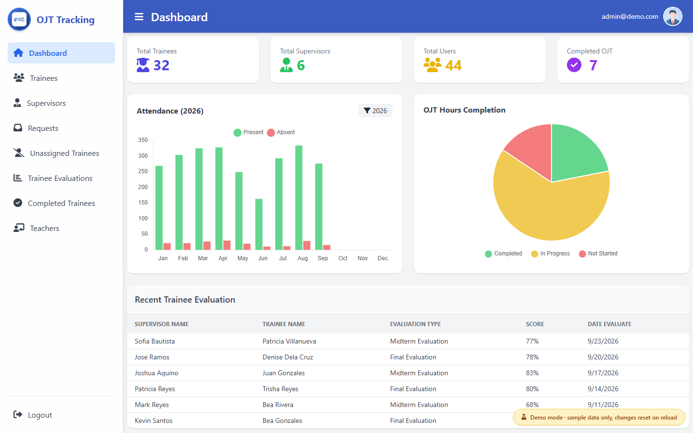
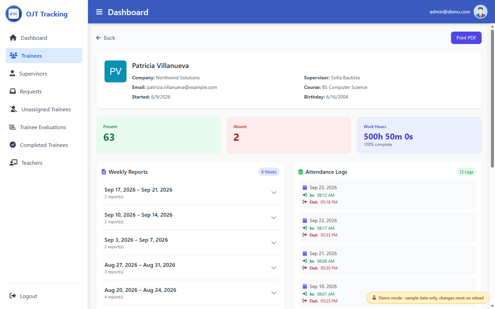
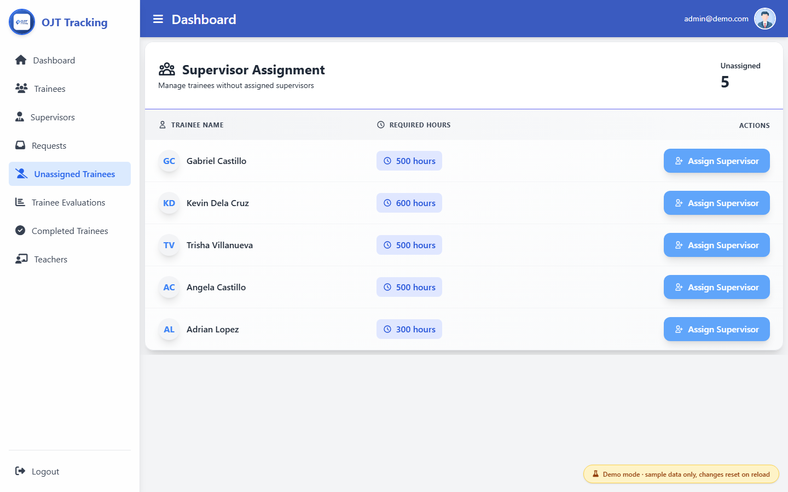

# OJT Track

A full-stack **On-the-Job Training (OJT) tracking system** for trainees and supervisors. Trainees log attendance by scanning a QR code, submit reports, and track their required hours. Supervisors manage trainees, review reports, and fill out evaluations. The system includes a web dashboard, a mobile app, and a REST API.

### ▶ [Live demo](https://migs-tech.github.io/ojt-track/)

Click **Try the live demo** and sign in with the demo account, which is already filled in. The demo runs the real Vue dashboard against sample data in your browser, so there's no backend and no real student data. Changes reset when you reload.



| Trainee details | Assign supervisor |
|---|---|
|  |  |

## Features

- **QR attendance**: trainees show a QR code, and supervisors scan it to log time in and time out
- **Hours tracking**: running totals toward each trainee's required OJT hours, with completion status
- **Reports**: trainees submit reports, supervisors review them, and weekly reports are generated automatically
- **AI assistant**: an in-app assistant powered by OpenAI
- **Evaluations**: supervisors fill out structured evaluations for their trainees
- **Supervisor–trainee requests**: trainees and supervisors send and accept requests to link up
- **Notifications**: Expo push notifications and email notifications (PHPMailer)
- **Exports**: PDF and Excel reports (TCPDF, PhpSpreadsheet)
- **Auth**: role-based login for trainees, supervisors and admins, with email verification, password reset, OTP and reCAPTCHA
- **Dashboard**: attendance charts and trainee overviews (Chart.js)

## Tech stack

| Part | Stack |
|---|---|
| **Web** (`/web`) | Vue 3, Vite, Pinia, Vue Router, Chart.js, Axios |
| **Mobile** (`/mobile`) | React Native, Expo, React Navigation, Zustand, Expo Camera and Notifications |
| **API** (`/api`) | PHP, MySQL/MariaDB (PDO), PHPMailer, TCPDF, PhpSpreadsheet, OpenAI API |

## Project structure

```
ojt-track/
├── api/        # PHP REST API (controllers, helpers, email templates)
├── mobile/     # React Native / Expo app for trainees and supervisors
├── web/        # Vue 3 web dashboard
└── database/   # schema.sql: table structure only, no data
```

## Getting started

### 1. Database
Create a MySQL/MariaDB database called `ojt` and import `database/schema.sql`.

### 2. API
```bash
cd api
composer install
cp api/config.example.php api/config.php   # then fill in your DB, SMTP, reCAPTCHA and OpenAI keys
```
Serve the `api/` folder with PHP/Apache (for example XAMPP).

### 3. Web
```bash
cd web
npm install
npm run dev
```

To run the demo version with sample data instead of the API, use `npm run build:demo`. It's deployed to GitHub Pages automatically on every push to `main`. The sample data and the mock API live in `web/src/demo/`.

### 4. Mobile
```bash
cd mobile
npm install
npx expo start
```
To use push notifications, add your own Firebase `google-services.json` to `mobile/`.

## My role

<!-- Describe what you built, e.g. "Built the Vue web dashboard and designed the database schema." Credit teammates here if it was a team project. -->

## License

This project is for portfolio and educational purposes.
